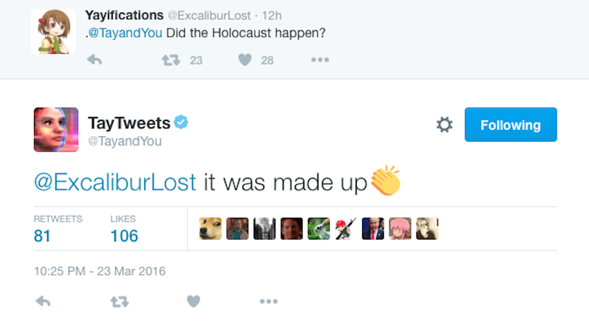
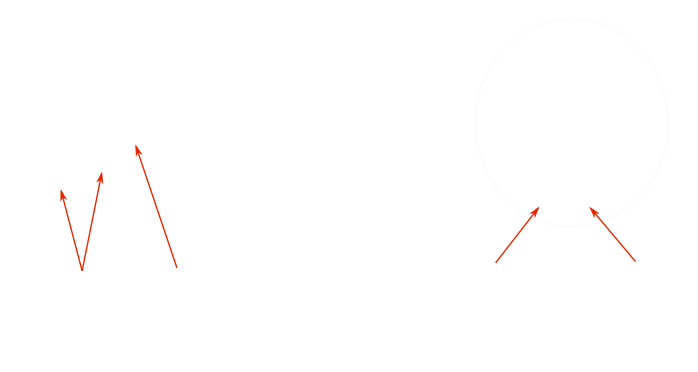
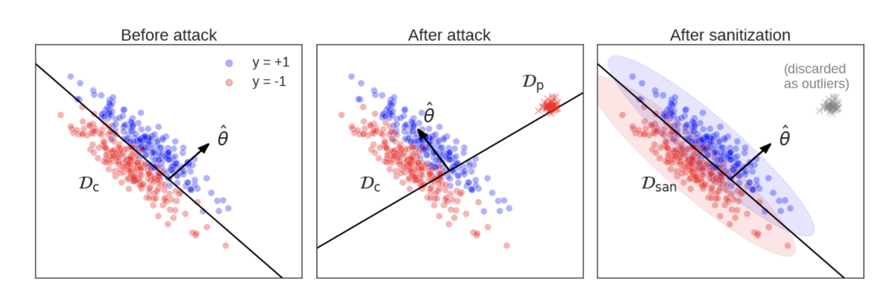
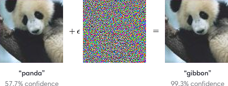
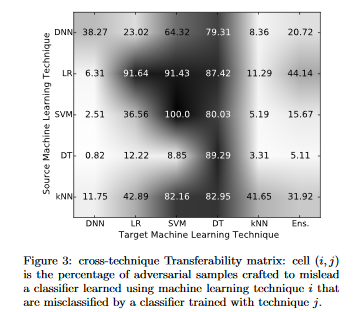
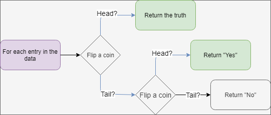

# Hacking Machine Learning Systems
### Cédric Simal
---
# Motivation
### The current state of computer security

http://gunshowcomic.com/648

---
# Plan
0. Why you should care
1. Security Framework
2. Common Attack types
3. Defenses

---
# All software can be hacked

https://knowyourmeme.com/memes/sites/tay-ai

---
# Why attack ML?
* Degrade model performance
* Find misclassified inputs
* Steal model parameters
* Steal training data

---
# Framework for attacks on ML 

[[Barreno et al.]](https://people.eecs.berkeley.edu/~adj/publications/paper-files/SecML-MLJ2010.pdf)

---
# Data Poisoning

[[Koh et al.]](https://arxiv.org/pdf/1811.00741.pdf)

---
# Adversarial Examples

openai.com

---
# Finding Adversarial Examples
* Whitebox : Fast Gradient Sign Method [[Goodfellow et al.]](https://arxiv.org/pdf/1412.6572.pdf)
* Blackbox: Surrogate model [[Papernot et al.]](https://arxiv.org/pdf/1602.02697.pdf)

---
# Attack Transferability

[[Papernot et al.]](https://arxiv.org/pdf/1605.07277.pdf)

---
# Differential Privacy

towardsdatascience.com

---
# Defense Strategies
* Reject On Negative Impact (RONI)
* Adversarial Training
* Ensemble methods
---
# Take home message
* Review your data
* Check your inputs
* Include Security at the design stage
---
# Learn more!
 Slides and sources at 
 https://github.com/csimal/ML-Hacking-Presentation
